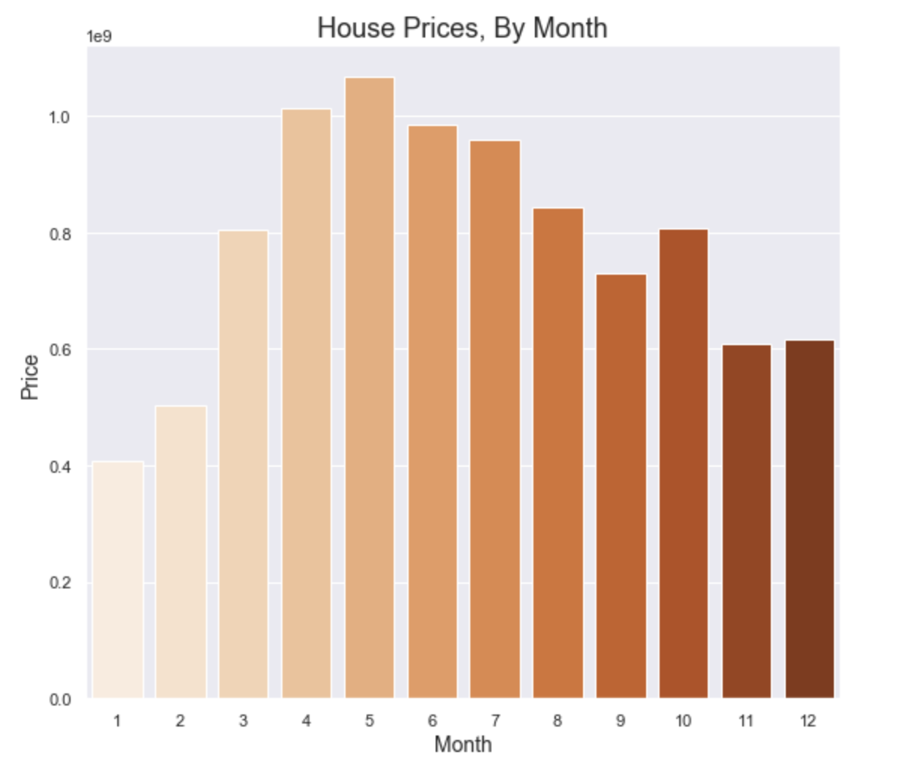

# Kings County Housing Prices
#### Flatiron School Data Science Program - Project 2 By Amelia Dahm Oct. 23nd, 2020

## Background

With data exploration, statistical testing, and feature engineering, I developed a regression model to take variables that can predict the price of a house in Kings County in Seattle, Washington. This repository contains the files that lead to the final predictions for a holdout dataset that had not been trained on the model and do not have the prices included. 

### Deliverables:
1. [GitHub repository](https://github.com/ameliadahm20/housing-pricing)
2. [Jupyter Notebook](KingsCountyHousingPrices.ipynb)
3. [Holdout predictions](housing_preds_amelia_dahm.csv)

# Exploration Questions

## 1. How does the value of a house fluctuate over the course of the year?
Many factors can determine when someone is going to buy a house. How nice the weather is where they live, an end of the year bonus check, and more. Even though the buyer may not know, prices can flucuate based on the busy season of house sales. For this project, I wanted to determine what time of year will houses be listed at their highest price.

()

## 2. Will rennovating a house have a positive return on investment?
A newly rennovated house is going to be listed at a higher price. For this project, I wanted to explore houses that have been rennovated, how long ago they were rennovated, and how it can affect price. Putting in the time and money to update it right before selling is appealing to a lot of buyers. 

## 3. How do the schools that surround a house impact the price it will sell for?
If a buyer has children, they are going to think more about certain variables. Being next to a school that is well-rated and going to get your child a good education can be very enticing. What school district you live in impacts what public school your child can go to, so for this project, I pulled in the top 35 schools from [this website](https://www.publicschoolreview.com/washington/king-county) to help predict the how prices accurately.

